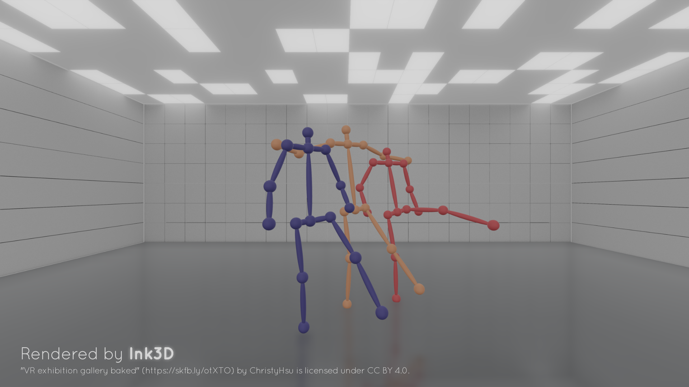

# TwinPose

[](http://doge.mit-license.org)

**[SIGGRAPH 2026]** Official implementation of *"TwinPose: Person-Specific Subspaces for Multi-View 3D Pose Estimation"*

TwinPose is a real-time multi-person multi-view 3D human pose estimation algorithm and system. TwinPose achieves state-of-the-art performance on public datasets while delivering superior computational efficiency, making it capable of handling complex scenarios with a large number of views and dense crowds.

This project is powered by [Ink3D](https://github.com/HYPER-THEORY/Ink3D).



## Getting Started

Clone the repository with all submodules.
```
git clone --recursive --depth=1 https://github.com/HYPER-THEORY/TwinPose.git
```
Run Setup_vs2022.bat or Setup_vs2026.bat to generate Visual Studio 2022/2026 project files. The solution will be written to the build directory.

Open the solution file, set the solution configuration to Release, and select `Build`.

After the build completes, in the Solution Explorer, right‑click on the TwinPose project and select `Set as Startup Project`. Then click the `Run` button (or press `F5`) to launch the application.

If you are not using Visual Studio, you can manually configure the project via CMakeLists.txt.

Click `Import Dataset JSON` and `Import Algorithm JSON` to load the Shelf dataset parameters, then click `Load Dataset` at the bottom. If everything goes well, you will see the algorithm's execution results on the Shelf dataset, presented as a visualized 3D scene.

## Dataset Configuration

TwinPose supports detection formats such as OpenPose, MMPose, and CID, dataset formats such as Shelf, 4DA, and Panoptic, as well as various skeletal spaces. We configure all parameters required for algorithm execution through a standardized pipeline. The parameter details are as follows:

**Cameras**

| Parameter | Description |
|---|---|
| Camera Loader | Camera loader type |
| Camera Load Path | Path to load camera data |

**Detections**

| Parameter | Description |
|---|---|
| Detection Loader | Detection loader type |
| Detection Skel Type | Detection skeleton type |
| Detection Load Path | Path to load detection data |
| Detection Joint Type Num | Number of joint types in the detection data |
| Detection View Num | Number of views, typically also the number of detectors |
| Detection Max Person Num | Maximum number of persons detected |
| Frame Begin | Starting frame from which detection data will be loaded, results before this frame will be discarded |
| Frame End | Ending frame up to which detection data will be loaded, results after this frame will be discarded |
| Detection Joint 2D Scale | Scale factor for detection joint UV coordinates. If the detection process used a non-original-resolution image, set scale to detection resolution divided by original resolution |

**Ground Truth**

| Parameter | Description |
|---|---|
| Ground Truth Loader | Ground truth type |
| Ground Truth Skel Type | Ground truth skeleton type |
| Ground Truth Load Path | Path to load ground truth data |
| Ground Truth Joint Type Num | Number of joint types in the ground truth data |
| Ground Truth Max Person Num | Maximum number of persons in the ground truth, poses with Person ID exceeding this value will be discarded |
| Sync Points Path | Path to synchronization points data. If this field is empty, detection data and ground truth data are assumed to be in one-to-one correspondence on the timeline |

**Result Correction**

| Parameter | Description |
|---|---|
| Result Correction | Apply correction to algorithm output on specific datasets |

These parameters can be set manually via the graphical interface or imported directly from a dataset.json file, for example with dataset/shelf/dataset.json.

## Algorithm Configuration

**Universal Parameters**

| Parameter | Description |
|---|---|
| Use Bone Length Score | Whether to use bone length as a component of the bone score |
| Use Edge Num In Association | Whether to use edge count instead of edge weight during association |
| Max Person Num | Maximum number of persons output by the algorithm. When set to 0, the default maximum output equals Detection Max Person Num |
| Max Joint Radius | Maximum radius for forming a 3D joint point |
| Max Joint Cluster Radius | Maximum radius for forming a 3D joint point cluster, typically set to around twice the Max Joint Radius |
| Conf Discard Threshold | Confidence threshold. Joints with confidence below this threshold will be discarded, and the retained confidence will be linearly remapped to 0–1 |
| Conf Exponent | Confidence exponent, used to adjust the confidence curve |
| Association Score Threshold | Minimum score threshold for generating association edges |
| Pose Discard Threshold | Discard threshold for algorithm output poses, used to discard low-quality pose results. When set to 0, Max Person Num poses are always output |

**Temporal Parameters**

| Parameter | Description |
|---|---|
| Use Temporal Information | Whether to use temporal information |
| Tracking Distance | If the movement distance of a bone within one frame exceeds this value, no temporal relationship is considered between the two bones |
| Tracking Discard Threshold | If the score from the previous frame's pose to the current frame's pose is below this threshold, no temporal relationship is considered between the two poses |
| Lost Track Penalty | If a candidate bone cannot find a temporally related bone in the previous frame, its score is multiplied by this penalty |

All length/radius/distance parameters are specified in meters.

These parameters can be set manually via the graphical interface or imported directly from an algorithm.json file, for example with dataset/shelf/algorithm.json.

## Evaluation Metrics

TwinPose provides 3 different built-in evaluation metrics:

**PCP** (Percentage of Correct Parts)

- A limb is considered detected and a correct part if the distance between the two predicted joint locations and the true limb joint locations is at most half of the limb length
- For OpenPose BODY25, the following joint pairs are used:
```
{{1, 8}, {2, 3}, {3, 4}, {5, 6}, {6, 7}, {9, 10}, {10, 11}, {12, 13}, {13, 14}, {0, 1}}
```

**PCK** (Percentage of Correct Keypoints)
- A detected joint is considered correct if the distance between the predicted and the true joint is within a certain threshold
- For OpenPose BODY25, the following joints are used:
```
{0, 2, 3, 4, 5, 6, 7, 9, 10, 11, 12, 13, 14}
```

**MPJPE** (Mean Per Joint Position Error)
- Mean Euclidean distance between ground truth and prediction for all joints
- For OpenPose BODY25, the following joints are used:
```
{0, 2, 3, 4, 5, 6, 7, 9, 10, 11, 12, 13, 14}
```

## Controls

| Input | Action |
|---|---|
| `Space` | Play / Pause |
| `Left` / `Right` | Step backward / forward |
| `0`–`6` | Switch visualization debug mode |
| Press `RMB` + `W`/`A`/`S`/`D` | Move the camera |
| Press `RMB` + drag | Change the camera orientation |

## Dependencies

| Library | Description |
|---|---|
| [Ink3D](https://github.com/HYPER-THEORY/Ink3D) | Lightweight framework for 3D rendering |
| [SDL2](https://github.com/libsdl-org/SDL) | Simple DirectMedia Layer |
| [OpenCV](https://github.com/opencv/opencv) | Open Source Computer Vision Library |
| [ImGui](https://github.com/adobe/imgui) (Adobe fork) | A Spectrum-inspired fork of Dear ImGui |
| [Json](https://github.com/nlohmann/json) | JSON for Modern C++ |

## Citation

If you find this project useful in your research, please cite:

```bibtex
@inproceedings{twinpose2026,
  author    = {Yang, Wenwu and He, Tianyi and Ding, Jiwei and Wang, Xun and Zhang, Rong and Zhou, Kun},
  title     = {TwinPose: Person-Specific Subspaces for Multi-View 3D Pose Estimation},
  booktitle = {ACM SIGGRAPH 2026 Conference Proceedings},
  year      = {2026}
}
```
